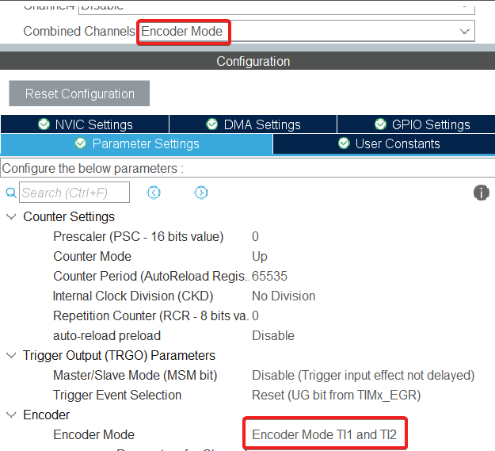

# STM32 Servo control
Модуль для регулирования коллекторного двигателя с энкодером.
## Возможности
 - Использование одного/двух/трех контуров управления (по положению, угловой скорости и току)
 - Регулирование как положения, так и угловой скорости (при наличии контура скорости)
 - Встроен алгоритм управления каналом таймера в режиме генерации ШИМ, а также выбором направления вращения мотора с помощью двух GPIO

## Установка
Распаковать архив _servocontrol.zip в папку проекта.

В файлах main.c и stm32...xx_it.c включить следующий файл:
```c
/* USER CODE BEGIN Includes */
#include <servocontroller.h>
/* USER CODE END Includes */
```
## Использование
### Настройка проекта
Для работы одного мотора необходимо инициализировать:
1. Таймер в режиме энкодера, к каналам которого необходимо подключить энкодер.
   Настройки таймера для наибольшей точности:
   
3. Канал другого таймера в режиме генерации ШИМ
### Инициализация
