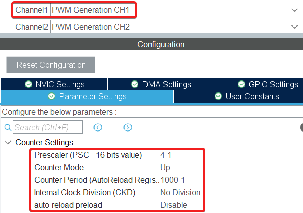

# STM32 Servo control module
Модуль для регулирования коллекторного двигателя с энкодером.
## Возможности
 - Использование одного/двух/трех контуров управления (по положению, угловой скорости и току)
 - Регулирование как положения, так и угловой скорости (при наличии контура скорости)
 - Встроен алгоритм управления каналом таймера в режиме генерации ШИМ, а также выбором направления вращения мотора с помощью двух GPIO

# Пошаговая инструкция по использованию
## Установка
Распаковать архив _servocontrol.zip в папку проекта.

В файлах main.c и stm32...xx_it.c включить следующий файл:
```c
/* USER CODE BEGIN Includes */
#include <servocontroller.h>
/* USER CODE END Includes */
```
## Использование
### Настройка проекта
Для работы одного мотора нужно инициализировать:
1. Таймер в режиме энкодера, к каналам которого необходимо подключить энкодер.
   
   Настройки таймера для наибольшей точности:
   
   
3. Канал другого таймера в режиме генерации ШИМ, к пину которого подключаем вывод PWM драйвера.

   Частоту работы ШИМ необходимо выбирать исходя из характеристик драйвера. Например, если в характеристиках драйвера указано до 20 кГц, стоит установить 18 кГц (небольшой запас прочности). Частота от 18 кГц наиболее оптимальна, т.к. это за пределами порога слышимости большинства людей.

   

4. Два GPIO в режиме output для управления направлением вращения мотора с помощью драйвера.

### Объявление экземпляра структуры
Для каждого контролируемого привода необходимо инициализировать экземпляр типа `servocontrol_t` в файлах main.c:

```c
/* USER CODE BEGIN PV */
servocontrol_t servo1;
/* USER CODE END PV */
```

и stm32...xx_it.c:
```c
/* USER CODE BEGIN EV */
extern servocontrol_t servo1;
/* USER CODE END EV */
```
### Инициализация
Теперь необходимо проинициализировать отдельные компоненты модуля необходимыми настройками.

**Внимание:** `servocontrol_t *servo` во всех функциях - указатель на экземпляр структуры, т.е. первый аргумент должен выглядеть так: `&yourServoName`. Далее это объясняться не будет.
```c
void servo_baseInit(servocontrol_t *servo, enum loops servoLoops, float motorSpeed, float gearRatio, uint8_t reverse);
// servoLoops - количество используемых контуров управления
//   Single - регулирование по углу положения вала
//   Double - подчиненное регулирование по положению и угловой скорости
//   Triple - подчиненное регулирование по положению, угловой скорости и току (пропорционален моменту)

// motorSpeed - скорость привода до редуктора в РАД/С
// gearRatio - передаточное число редуктора привода. Например, если передаточное число 1:21.3, передайте 21.3.
// 		Если редуктора нет, или хотите регулировать до привод без учета редукции
//		(бывает полезно при большом влиянии вязкого трения редуктора на работу привода), передайте 1.
// reverse - определяет направление вращения, передайте 0 или 1

void servo_encoderInit(servocontrol_t *servo, TIM_HandleTypeDef *htim, uint16_t CPR);
// htim - указатель на обработчик таймера, например &htim1, если используется TIM1
// CPR - количество счетов регистра таймера за один оборот мотора (если использованы два канала, CPR=(PPR*4)-1.
//		PPR можно узнать из характеристик энкодера.

void servo_driverInit(servocontrol_t *servo, TIM_HandleTypeDef *htim, uint8_t timerChannel,
		GPIO_TypeDef *dir1_Port, uint32_t dir1_Pin, GPIO_TypeDef *dir2_Port, uint32_t dir2_Pin,
		uint16_t minDuty, uint16_t maxDuty);
// htim - обработчик таймера, генерирующего ШИМ-сигнал.
// timerChannel - номер канала таймера, который контролирует скорость данного привода (числом: 1/2/3/4)
// Далее пины, управляющие направлением вращения привода через драйвер (с указанием портов)
// minDuty - минимальное значение шим, отличное от нуля, которое будет выдавать микроконтроллер (обычно 0)
// maxDuty - максимальное значение шим, которое будет выдавать микроконтроллер.
//		Рекомендую взять значение, равное ARR-1, где ARR - arr регистр таймера
//		Стоит уменьшить его на единицу, так как при полном заполнении есть риск перегрева мосфетов.

// Следующие инициализаторы - настройки контуров управления
// Рекомендуется инициализировать только те контуры, которые будут использоваться

// kp, ki, kd - коэффициенты ПИД регулятора контура
// dt - период работы каждого контура (очень важно соблюдать эту величину)
// kt - коэффициент алгоритма anti-windup. Нельзя использовать при отсутствии интегральной составляющей (оставить 0)
void servo_positionInit(servocontrol_t *servo, float kp, float ki, float kd, float dt, float kt);
void servo_velocityInit(servocontrol_t *servo, float kp, float ki, float kd, float dt, float kt);
void servo_currentInit(servocontrol_t *servo, float ratedCurrent, float kp, float ki, float kd, float dt, float kt);
// ratedCurrent - номинальный ток мотора в амперах
```
